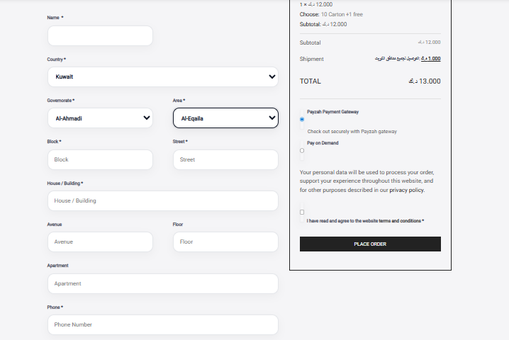

# WooCommerce Kuwait Checkout Customization

## Screenshot

## Project Overview

Custom WooCommerce checkout optimization for Kuwait-based ecommerce stores.

This solution improves the checkout experience by replacing standard WooCommerce address fields with a Kuwait-friendly structure including governorates, areas, blocks, streets, and house numbers.

## Features

- Kuwait governorates support
- Area selection fields
- Custom address structure
- Improved checkout usability
- Mobile-friendly checkout
- WooCommerce compatibility
- Local payment gateway support
- KNET ready workflow
- Enhanced customer experience

## Technologies Used

- WordPress
- WooCommerce
- PHP
- JavaScript
- CSS

## Customizations

- Custom billing fields
- Checkout field validation
- Kuwait-specific address formatting
- Order information enhancements
- Improved delivery address collection

## Business Benefits

- Faster checkout process
- More accurate delivery addresses
- Better customer experience
- Reduced delivery issues
- Optimized for Kuwait market

## Author

Abdulrhman Khalaf

WordPress & WooCommerce Developer

GitHub:
https://github.com/abdulrhmankaizen
